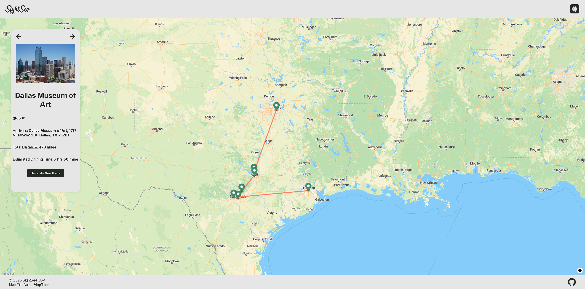

<h1 align="center" id="title">SightSee USA</h1>

<p id="description">This project is a React-based web app that helps users generate optimized travel routes within a selected U.S. state. Whether you're planning a road trip or sightseeing adventure the app selects the most efficient path between multiple points of interest based on how many stops you want to make.</p>

<h2>🚀 Demo & Figma</h2>

[Preview Project Demo](https://code-jam-kohl.vercel.ap)
[View Figma Design](https://www.figma.com/design/ezhYFhBBlEThr500wM9lJN/Code-Jam?node-id=0-1&p=f&t=hHY9YaafRInQuYp3-0)

<h2>Project Screenshots:</h2>



<h2>🧐 Features</h2>

Here're some of the project's best features:

- Dark and Light modes
- Optimized Routing
- Polished Animations
- Trip Customization

<h2>🛠️ Installation Steps:</h2>

<p>1. Install Node v22+</p>

```
git clone git@github.com:donnyjb06/sightsee-usa.git
```

<p>2. Clone repository</p>

```
git clone git@github.com:donnyjb06/sightsee-usa.git clone git@github.com:donnyjb06/sightsee-usa.git
```

<p>3. Change into front-end directory</p>

```
cd ./front-end
```

<p>4. Install dependencies</p>

```
npm i
```

<p>5. Insert MapTiler API Key(free) into .env file</p>

```
VITE_MAP_TILER_API_KEY=3x4mp1e-4pi-k3y
```

<p>6. Run development server</p>

```
npm run dev
```

<h2>💻 Built with</h2>

Technologies used in the project:

- React
- Framer Motion
- Wikipedia Images API
- MaplibreJS

<h2>🛡️ License:</h2>

This project is licensed under the MIT
